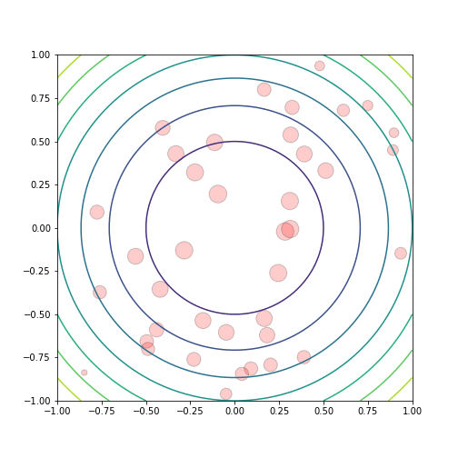
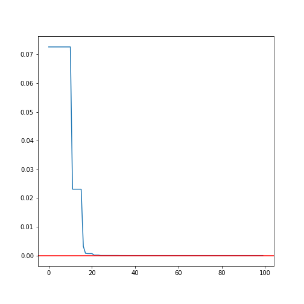
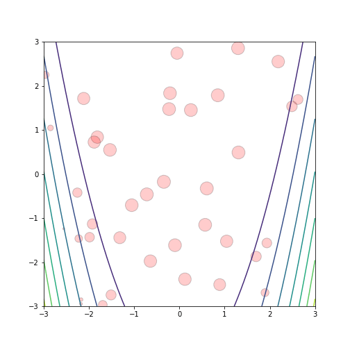

# GSA: Gravitational Search Algorithm

### An heuristic optimization method

**ISAE-SUPAERO, SDD, November 2019**

CAMACHO BOSCA Jose Ramon, DIAZ Alejandro

<!--v-->

### GSA resume

Agents are considered as objects as their performance is measured by their masses.

- Law of gravity: Each particle attracts every other particle.<!-- .element: class="fragment" data-fragment-index="1" -->
- Law of motion: Velocity is equal to the sum of its previous velocity and the variation of the velocity. <!-- .element: class="fragment" data-fragment-index="2" -->

$$v_i^d (t+1) = rand_i v_i^d(t) + a_i^d(t)$$ <!-- .element: class="fragment" data-fragment-index="3" -->
$$x_i^d(t+1) = x_i^d(t) + v_i^d(t+1)$$ <!-- .element: class="fragment" data-fragment-index="3" -->

<!--v-->

### Inspiration in the physical nature

Newton's second law : $a=F/M$

Newton's gravitational force: $$F = \dfrac{GM_1M_2}{R^2}$$

$G(t) = G(t_0)\left(\dfrac{t_0}{t}\right)^\beta$   $\beta<1$

$G(t_0)$ is the gravitational constant at the **first cosmic quantum-interval** of time

<!--v-->

### Diagram de Forces:

$$F_{if} = \dfrac{GM_{j}M_{i}}{R^2}$$
$$F_{i}^d(t) = \sum_j^{N}rand_j\dfrac{GM_{j}M_{i}}{R^2}$$
$$a_i^d(t) = \dfrac{F^d_{i}}{M_{i}}$$

<!--v-->

### Evolution of the masses

A heavier mass means a more efficient agent. Better agents have higher attractions and walk more slowly. 

$$m_i(t) = \dfrac{fit_{i}(t) - worst(t)}{best(t) - worst(t)}$$
$$M_i(t) = \dfrac{m_i(t)}{\sum_j^N m_j(t)}$$

<!--v-->

<!--s-->

> Paraboloid function 

<!--v-->

> Rastrigin function 

<!--v-->

> Rosenbrock function 

<!--s-->

### COMPARATION OF THE ALGORITHM

Extracted from the same reference paper as we study 

<!--s-->

### CONCLUSION ...

- The gravitational force is a way of transferring information between different masses.<!-- .element: class="fragment" data-fragment-index="1" -->
- A local search (e.g. gradient descent, bfgs) should be done after running the GSA <!-- .element: class="fragment" data-fragment-index="2" -->
- The results obtained by GSA in most cases provide superior results and in all cases are comparable with PSO, RGA and CFO <!-- .element: class="fragment" data-fragment-index="3" -->
- Using plots with a good animation seem to be a better algorithm <!-- .element: class="fragment" data-fragment-index="4" -->

<!--s-->

### ''le mieux est l’ennemi du bien''
<small align="right">Montesquieu</small>